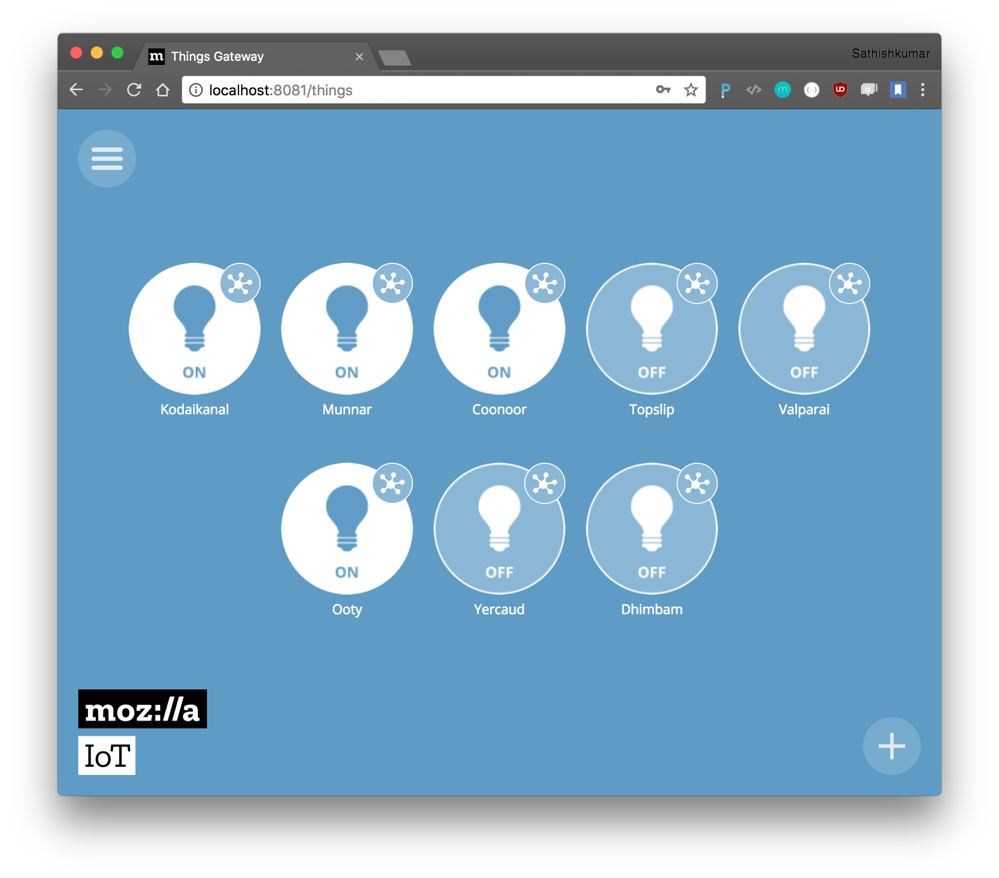

[](https://travis-ci.org/tsathishkumar/MySController-rs) [  ](https://bintray.com/tsathishkumar/myscontroller-rs/myscontroller-rs/_latestVersion)
# MySController-rs

Started as a project to support OTA for MySensors and proxy for all other requests. Now exposes [WebOfThings APIs](https://iot.mozilla.org/specification/) for MySensors (supporting very few sensors at the moment) and on it's way to be a fully functional API based controller for MySensors. Contributions to support other sensors are welcome.

## APIs to manage nodes and firmwares
[](https://app.getpostman.com/run-collection/3f99678c26301d779ebe)

All the APIs are available as postman collection and the docs can be found [here](https://documenter.getpostman.com/view/198173/myscontroller/RWEmHGeT#1d695865-c9c4-6738-e2b5-d75b31a880b7).

There is also a pending task to add Swagger UI as part of the server.


## Screenshots

Integration with [Things Gateway](https://iot.mozilla.org/)




This server also acts as a proxy between Gateway and the Controller. Both might be either connected through a serial port or a TCP connection.

Before running the server, set the correct connection type and connection port for Gateway and Controller in conf.ini file.

WoT api's are exposed at `https://{host}:8888`

## To run the server, by builing manually:
```
git clone https://github.com/tsathishkumar/MySController-rs.git
cd MySController-rs
cargo run
```

## To install and run as a service in a debian/ubuntu flavour machine
- Add the following to your /etc/apt/sources.list system config file:
    ```bash
    echo "deb http://dl.bintray.com/tsathishkumar/myscontroller-rs vivid main" | sudo tee -a /etc/apt/sources.list
    ```
- Update the package list
    ```bash
    apt-get update
    ```
- Install the package
    ```bash
    apt install myscontroller-rs
    ```
- The configuration of the server can be found at the below location. 
    ```bash
    /etc/myscontroller-rs/conf.ini
    ```
    Example settings:
    ```bash
    encoding=utf-8

    [Gateway]
    type=TCP
    port=10.11.12.13:5003

    [Controller]
    type=TCP
    port=0.0.0.0:5003

    [Server]
    database_url=/var/lib/myscontroller-rs/sqlite.db
    ```
- Set up the right Gateway IP and Controller IP and restart the service.
    ```bash
    systemctl restart myscontroller-rs.service
    ```


Note: If you are using TCP for controller - the port value will be used to create TCP server listening on the specified port. (So it shoud be the address of the machine running MySController)

## To Contribute
Check out the [TODO list](https://github.com/tsathishkumar/MySController-rs/wiki/TODO-list), and pick whichever you are interested or raise issues if you have encountered any.
